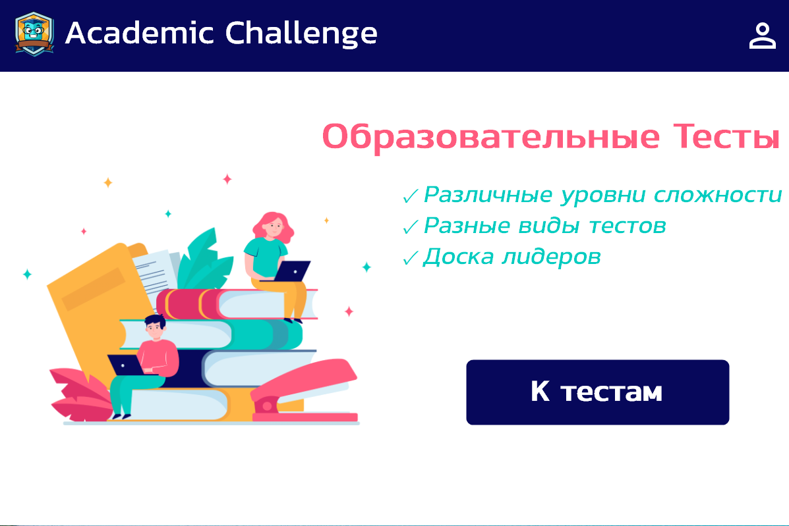
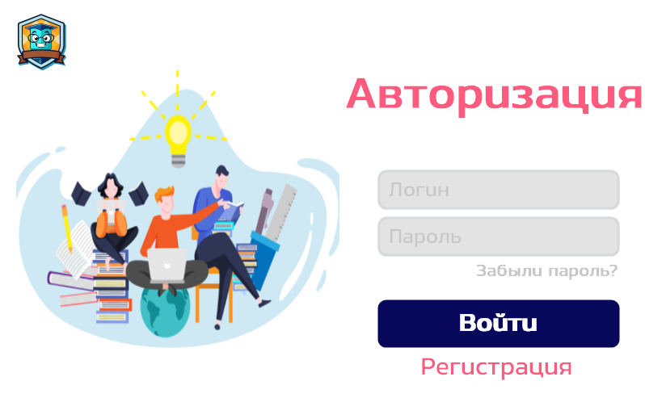
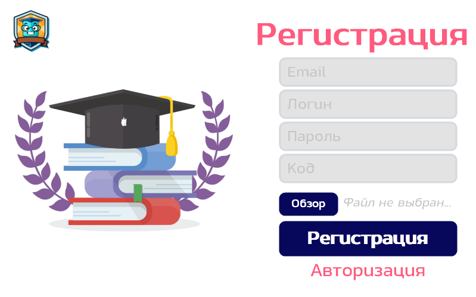
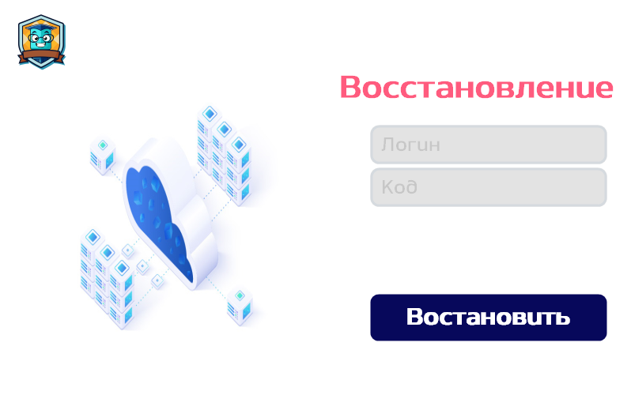
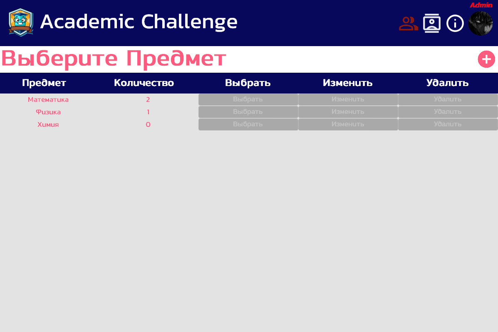
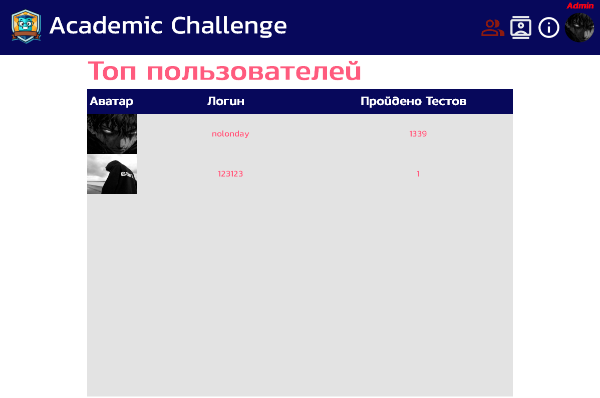
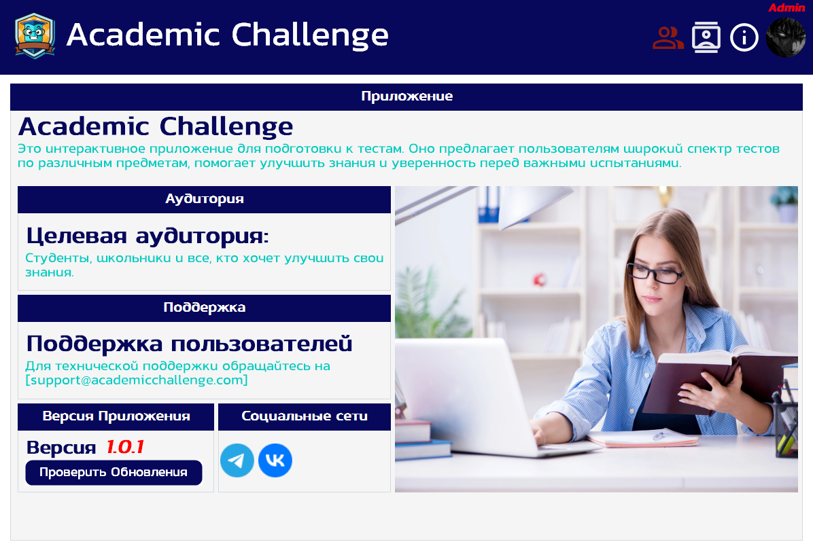
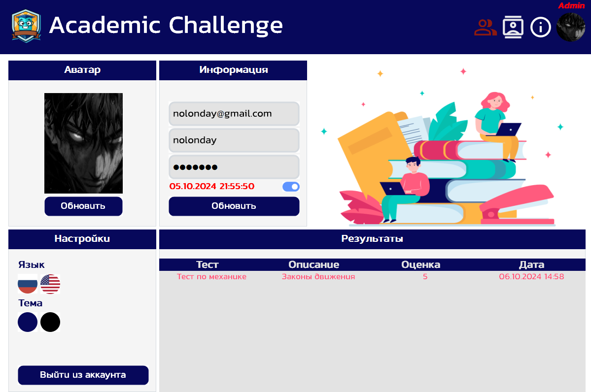
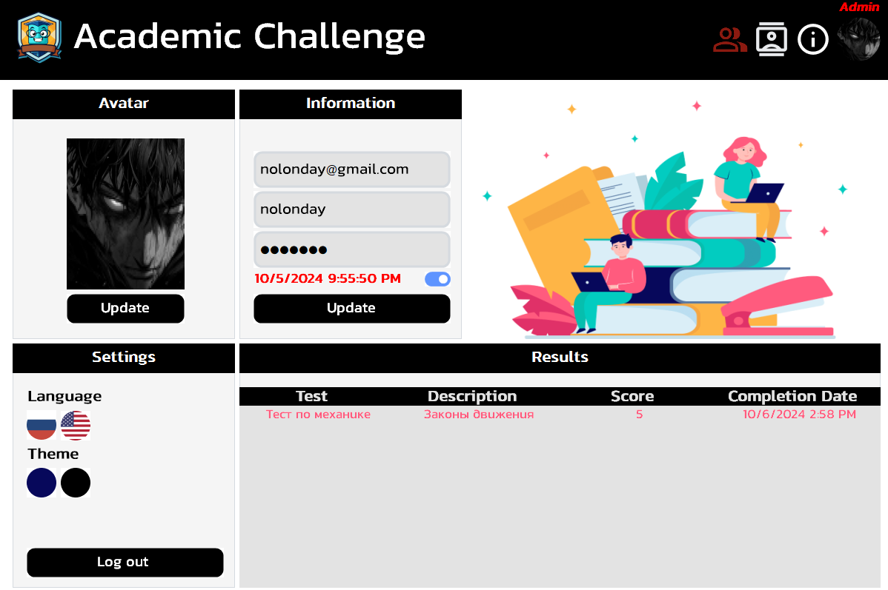

# Academic Challenge
Это интерактивное приложение для подготовки к тестам. Оно предлагает пользователям широкий спектр тестов 
по различным предметам, помогает улучшить знания и уверенность перед важными испытаниями.



## Установка 
1. Клонирование репозитория 

```git clone https://github.com/nolonday/Academic-Challenge```

2. Переход в директорию Setup

```cd Setup```

3. Открытие файла и установка приложения

```Setup.msi```

## Документация
Пользовательскую документацию можно получить по [этой ссылке](Docs/index.md).

## Поддержка
Если у вас возникли сложности или вопросы по использованию пакета, создайте 
[обсуждение](https://github.com/nolonday/Academic-Challenge/issues/new/choose) в данном репозитории или напишите на электронную почту <nolonday1337@gmail.com>.

## Фото приложения









